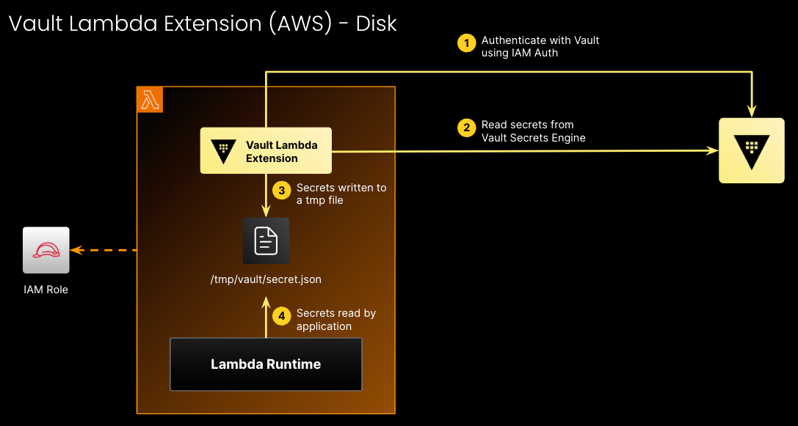
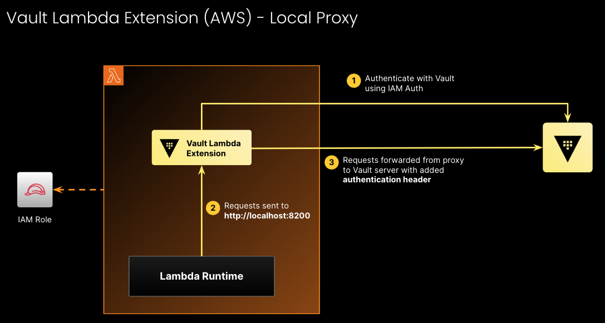

# Vault Lambda Extension Demo

**This demo will only work if your Vault is publicly accessible.** 

1. Export your `VAULT_TOKEN` as an environment variable.
```
export VAULT_TOKEN="<VAULT_TOKEN>"
```

2. Install HVAC Python dependency as Lambda Layer in the **root directory**
```
pip3 install hvac -t ./platform/tmp/layers/hvac/python
```

3. To deploy, perform a Terraform run in the `platform` directory
```
cd platform
terraform apply --auto-approve 
```

Add the following variables for Terraform:

| Variable          | Description                                            |
|-------------------|--------------------------------------------------------|
| target_account_id | The account to deploy the Lambda function into         |
| vault_addr        | Public URL of your Vault cluster                       |
| vault_account_id  | AWS Account ID where your Vault cluster is deployed in |

To get the `vault_account_id`, go into your HCP portal, click on HashiCorp Virtual Networks. 
Click on the hvn then you want to connect to, on the top right, click on `Create connection` button and select `Transit Gateway`. 

On the tab, click on `Web console` and when you scroll down, you should see the `AWS Account ID` information. 


# Vault Lambda Extension write to Disk


# Vault Lambda Extension as Local Proxy
